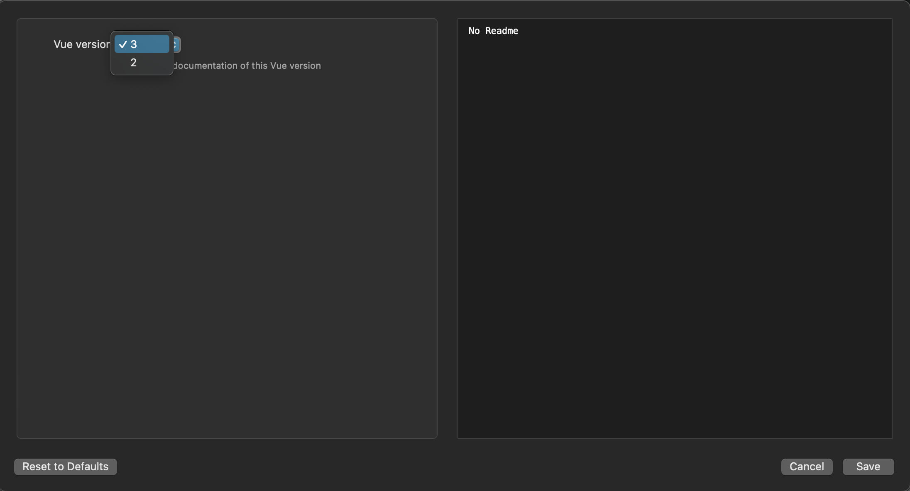

# Vue.js Docs Workflow for Alfred


Search the [Vue.js documentation](https://v3.vuejs.org/guide/introduction.html) using [Alfred](https://www.alfredapp.com/).


## Installation

1. [Download the latest version](https://github.com/techouse/alfred-vue-docs/releases/latest)
2. Install the workflow by double-clicking the `.alfredworkflow` file
3. You can add the workflow to a category, then click "Import" to finish importing. You'll now see the workflow listed in the left sidebar of your Workflows preferences pane.

## Usage

Just type `vue` followed by your search query.

```
vue composition
```

Either press `⌘Y` to Quick Look the result, or press `<enter>` to open it in your web browser.

## Changing Branches

The workflow supports searching the documentation of several versions. To change the branch, configure the Workflow as show in the image below.



### Note

The lightning fast search is powered by [Algolia](https://www.algolia.com) using the _same_ index as the official [Vue.js](https://v3.vuejs.org/) website.
