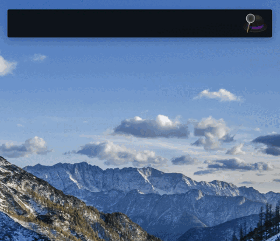
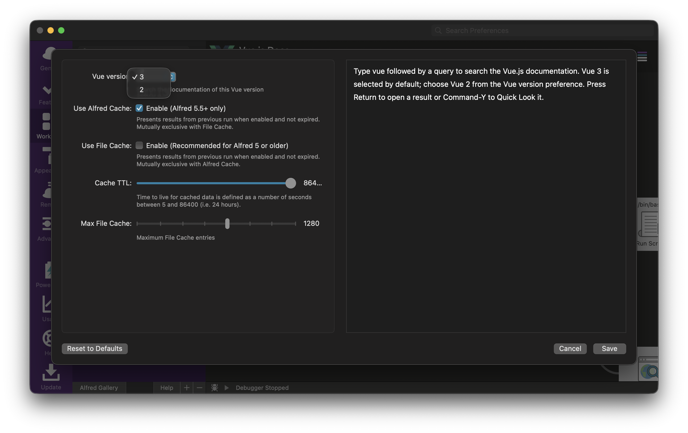

# Vue.js Docs Workflow for Alfred


Search the [Vue.js documentation](https://vuejs.org/guide/introduction.html) using [Alfred](https://www.alfredapp.com/).



## Installation

1. [Download the latest version](https://github.com/techouse/alfred-vue-docs/releases/latest)
2. Install the workflow by double-clicking the `.alfredworkflow` file.
3. Add it to an Alfred category if desired, then click **Import**.

## Usage

Type `vue` followed by a search query:

```text
vue composition
```

Choose the Vue version in the workflow configuration. Vue 3 is selected by default and Vue 2 is also available. The selected version is removed from the search expression when it appears as an exact, case-sensitive token.



Press `⌘Y` to Quick Look a result or press Return to open it in the browser.

The search is powered by [Algolia](https://www.algolia.com) using the same index as the official [Vue.js](https://vuejs.org/) documentation.

## Development

The workflow is implemented in Rust 2024 and requires Rust 1.88 or newer. Copy `.env.example` to `.env` and fill in the three Algolia search values, then run a local query:

```sh
cargo run -- -q "composition"
```

Install the locked license tool before running the complete local checks:

```sh
cargo install cargo-about --locked --features cli
make ci
```

`make package` builds a universal `.alfredworkflow` archive containing arm64 and x86_64 slices. The arm64 slice targets macOS 11.0 and the Intel slice targets macOS 10.15. `make build-release` remains available for a native development build.

Runtime Algolia values take precedence over the explicit working-directory `.env`, which takes precedence over values embedded during a release build. The `.env` file, caches, source files, screenshots, and build artifacts are never copied into the package.
